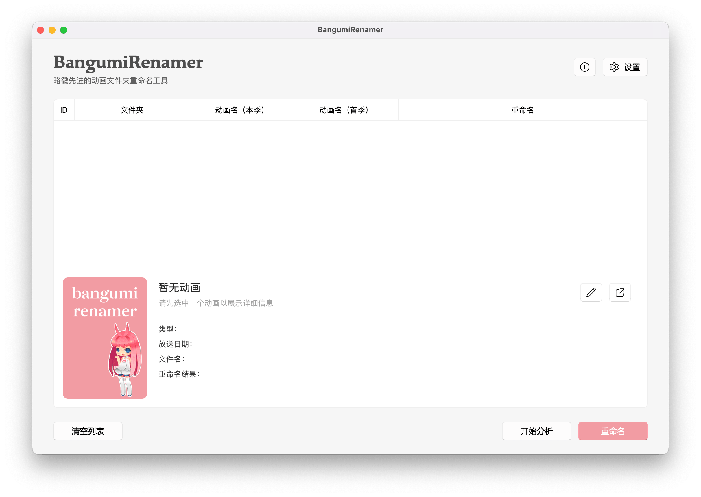

<p align="center">
    
    <br>
    <div align="center">
        
        
        
        
    </div>
</p>


## 介绍

一个基于 AniList 与 Bangumi 的略微先进的自动化命名工具，用来命名网络下载的番剧文件夹

仅需批量拖入文件夹，BangumiRenamer 会自动识别该动画的中日文名，支持自定义命名规则，免去手动整理费神又费力

<p align="center">
    
</p>

## 示例

自定义规则：

```
{init_name}/[{typecode}] [{release}] {jp_name}
```

拖入文件：

```
[Moozzi2] Tokyo Revengers [ x265-10Bit Ver. ] - TV + SP
[VCB-Studio] Kage no Jitsuryokusha ni Naritakute! [Ma10p_1080p]
```

命名结果：

```
东京复仇者/[01] [230107] 東京リベンジャーズ 聖夜決戦編
想要成为影之实力者！/[01] [221005] 陰の実力者になりたくて！
```

## 使用

1. 批量拖入需要重命名的文件夹，点击 `开始识别` 进行分析，大多数动画均可返回正确的结果
2. 若分析结果非该动画的正确季度，可在右下角列表区中右键，选择 `更正为此动画` 
3. 若有不想重命名的动画文件夹，可在动画列表中右键，选择 `删除此动画 `
4. 图片右侧可看到每个动画的重命名结果。若想要自定义命名规则，可在软件设置中修改
5. 确保重命名结果无误后，点击右下角 `重命名` 开始。命名完成后，操作不可撤销

##### 命名变量：

- `{jp_name}`：动画日文原名
- `{cn_name}`：动画中文译名
- `{init_name}`：第一季度的中文译名
- `{romaji_name}`：动画罗马名
- `{types}`：动画类型（TV、剧场版、OVA、OAD）
- `{typecode}`：动画类型代码（01：TV、02：剧场版、03：OVA与OAD）
- `{release}`：放送日期
- `{bepisodes}`：章节数量
- `{score}`：Bangumi 评分
- `{b_id}`：Bangumi ID

##### 数据来源：

- `AniList`：用于识别罗马名，第一搜索结果命中率极高
- `Bangumi`：核心数据的的主要来源

## 反馈

如需要更多功能支持，请在 Issues 中提出，酌情添加

如遇到程序错误，请在 Issues 中详细描述，并告知所用操作系统（Windows 11 or macOS 13.4）

## 致谢

[[AniList APIv2]](https://anilist.github.io/ApiV2-GraphQL-Docs/) 官方接口

[[Bangumi API]](https://github.com/bangumi/api) 官方接口

[[ChatGPT]](https://chat.openai.com/) 为我解答了诸多困惑

## 免责

本项目代码仅供学习交流，不得用于商业用途，若侵权请联系
