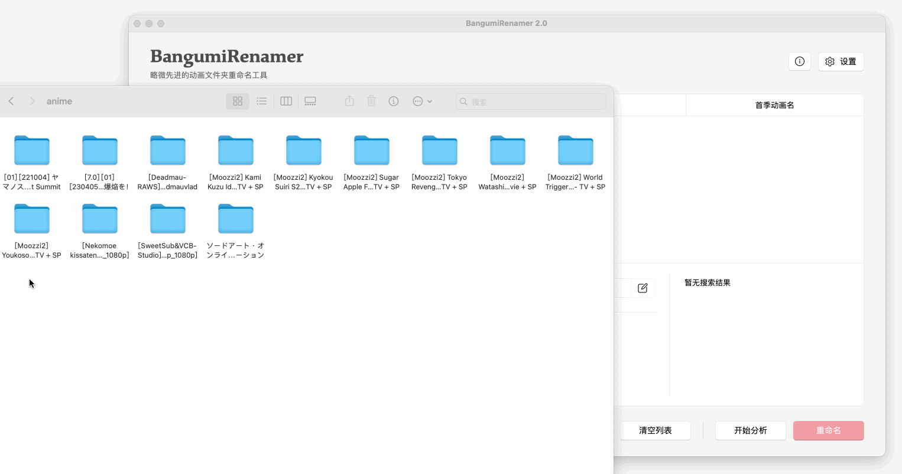
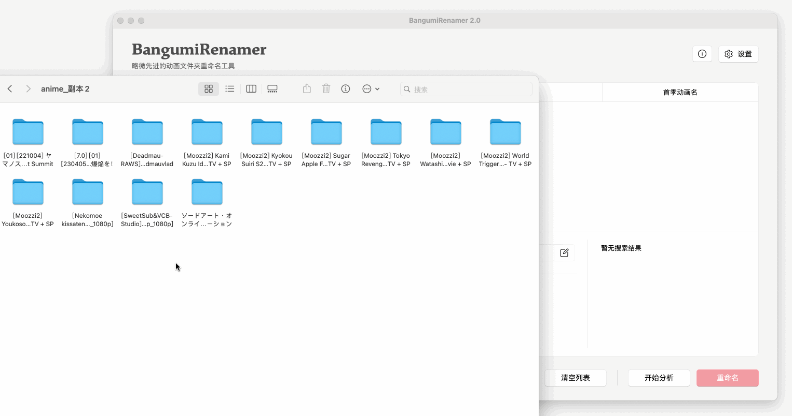

<p align="center">
    
    <br>
    <div align="center">
        
        
        
    </div>
</p>


## 介绍

基于 AniList 与 Bangumi 的略微先进的自动化命名工具，用来重命名网络下载的番剧文件夹

仅需批量拖入文件夹，BangumiRenamer 会自动分析该动画的中日文名，支持自定义命名格式，免去手动整理费神又费力

<p align="center">
    
</p>

## 特色

- 一键识别动画名称
- 支持多种命名格式
- 根据 ID 展示个人收藏状态
- 现代化的 UI 界面


## 示例

命名格式：

```
{init_name}/[{typecode}] [{release}] {jp_name}
```

拖入文件：

```
[Moozzi2] Kyokou Suiri S2 [ x265-10Bit Ver. ] - TV + SP
[VCB-Studio] Kage no Jitsuryokusha ni Naritakute! [Ma10p_1080p]
```

命名结果：

```
虚构推理/[01] [230108] 虚構推理 Season2
想要成为影之实力者！/[01] [221005] 陰の実力者になりたくて！
```

## 使用指南

#### 自动修改

<p align="center">
    
</p>

1. 拖入动画文件夹，点击 `开始分析` ，大多数动画均可返回正确的结果
2. 若季度识别错误，可在右下角右键选择正确的季度，点击 `更正为此动画` 
3. 若首季识别错误，可在列表中右键该动画，点击 `修改首季动画名` 
4. 若动画识别错误，可通过修改文件夹名称，或指定 Bangumi ID 的方式手动修改
5. 若有想排除的文件夹，右键选中该动画后，点击 `删除此动画 `
6. 确保重命名结果无误后，点击 `重命名` 开始。命名完成后，操作不可撤销

#### 手动修改

<p align="center">
    
</p>

1. 拖入动画文件夹，并选中要识别的动画
2. 在 ID 输入框中写入动画的 Bangumi ID，点击右侧确认修改
3. 确保重命名结果无误后，点击 `重命名` 开始。命名完成后，操作不可撤销

#### 命名变量

- `{jp_name}`：日文原名
- `{cn_name}`：中文译名
- `{init_name}`：第一季度的中文译名
- `{romaji_name}`：罗马名
- `{types}`：动画类型（TV、剧场版、OVA、OAD）
- `{typecode}`：动画类型代码（01：TV、02：剧场版、03：OVA与OAD）
- `{release}`：放送日期
- `{bepisodes}`：章节数量
- `{score}`：Bangumi 评分
- `{b_id}`：Bangumi ID

## 反馈

如需要更多功能支持，请在 Issues 中提出，酌情添加

如遇到程序错误，请在 Issues 中详细描述，并告知所用操作系统（Windows 11 or macOS 14.2）

## 致谢

[[AniList APIv2]](https://anilist.github.io/ApiV2-GraphQL-Docs/) 官方接口，用于获得第一搜索结果

[[Bangumi API]](https://github.com/bangumi/api) 官方接口，用于获取核心数据

[[Bangumi Link]](https://github.com/ekibot/bangumi-link) 用于获取条目关联数据

[[ChatGPT]](https://chat.openai.com/) 为我解答了诸多困惑

## 免责

本项目代码仅供学习交流，不得用于商业用途，若侵权请联系
